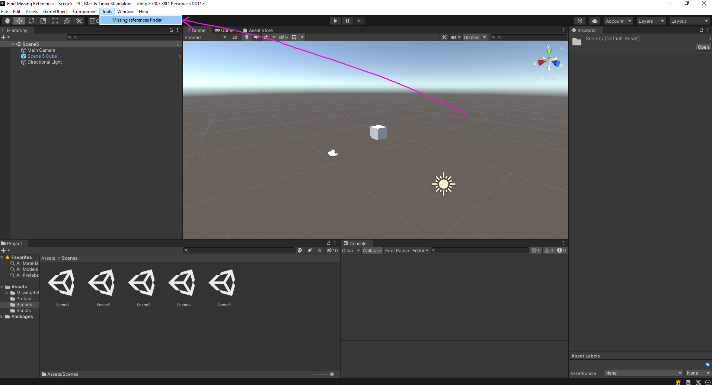

# Missing References Finder

## Описание
Инструмент проходит по всем префабам проекта в папке Assets и находит те, в которых есть missing ссылки на удалённые объекты. Найденные объекты и название полей с пропущенными ссылками выводятся в отдельном окне. Также есть возможность проверить ссылки объектов на отдельных сценах

## Как установить
1.Скачать проект
2.Скопировать папку MissingReferencesFinder в нужный проект в любую директорию папки Assets. Например, в корненвую папку, как показано на скриншоте 

## Как пользоваться
1. Открыть выпадающее меню Tools на верхней панели редактора Unity и выбрать Missing references finder

2. В открывшемся окне появится список всех сцен, которые есть в вашем проекте. Вы можете поставить галочки напротив тех сцен, которые вам необходимо проверить или не ставить ни одной галочки, если вам нужно проверить только префабы в папке проекта. Когда выберете нужные сцены, нажмите Find Misssing References.
Примечание: после нажатия на кнопку, закроются все открытые сцены, кроме одной.

3. После нажатия на кнопку, перед вами появится список объектов и ссылки, пропущенные в них. Первым полем каждого элемента является объект с пропущенной ссылкой. Вы можете кликнуть на него и он отметится в project explorer-e (или в hierarchy, если это объект с какой либо сцены)

4. Если объект является дочерним объектом другого элемента, то в полях под надписью "Located in" отмечаются его родитель, родитель его родителя, родитель родителя его родителя и т.д. Также, если такой объект является префабом, находящимся в папке Assets, то при клике, он не подсвечивается в project explorere(если объект находится на сцене, то подсветка в hierarchy работает корректно). Однако если кликнуть на него дважды, то откроется префаб и внутри него можно найти элемент по названию

5. Далее идёт таблица, в первом столбце которой находятся имена объектов с missing ссылкой, а во втором столбце названия компонентов, в которых находятся эти ссылки

6. Если на объекте есть отсутствующий скрипт, то в таблице в столбце "In component" у объекта будет написано Misssing Component

Если вы добавили или удалили какую-либо сцену, то необходимо перезапустить инструмент, чтобы отобразить её в списке

## Принцип работы
Инструмент ищет пропущенные ссылки, проходя по всем префабам, находящимся в папке Assets.
Более детально принцип работы следующий:
1. Получение пути до каждого файла в папке Assets
2. Получение компонентов файла, представленного в виде GameObject-a
3. Представление каждого компонента в виде SerializedObject-а и прохождение по его полям, представленным в виде SerializedProperty
4. Если у SerializedProperty есть id элемента, на который ссылается это поле, но сама ссылка равна null, значит элемент существовал, но был удалён. Добавляем этот элемент в список объектов, которые нужно показать пользователю, так как мы нашли missing ссылку

В случае, если нужно проверить файлы на сценах, инструмент работает следующим образом:
1. Открыть все сцены, напротив которых проставлены галочки
2. Получить и проверить все объекты с этих сцен, как и в предыдущем алгоритме

## Возможные способы поиска missing ссылок
Помимо вышеописанного способа, я пытался найти missing ссылки с помощью рефлексии, используя методы GetFields() и GetProperties(), а затем проверяя каждое свойство и поле компонента. Мне удалось обнаружить нулевые ссылки таким способом, но не получилось установить является ссылка missing или none.